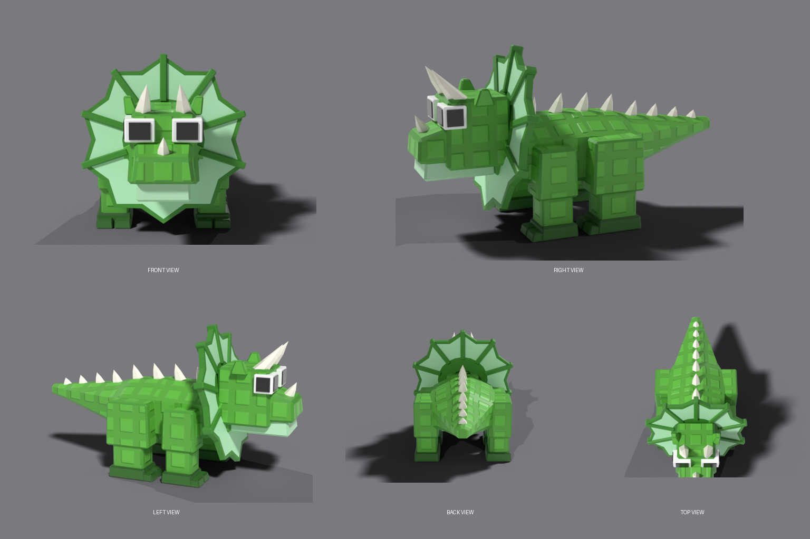

# Triceratops — Roblox-ready rigged creature

A blocky green Triceratops built to match `source/reference_triceratops.webp`. It is skinned to a
23-bone rig and has four animations. Everything is generated from `source/build_triceratops.py`.



## Files

| File | What it is |
|---|---|
| `Triceratops.fbx` | Skinned mesh + rig, rest pose, textures embedded. **Import this one.** |
| `animations/Triceratops_{Idle,Walk,Run,Attack}.fbx` | One take per file, same rig, for the Animation Editor's FBX import. |
| `textures/Triceratops_Color.png` / `_Normal.png` / `_Roughness.png` | 1024² SurfaceAppearance maps (normal map is OpenGL / +Y). |
| `textures/StudTile_Height.png` | The stud height tile the atlas was painted from. |
| `Triceratops.blend` | Blender 4.2 source scene with all four actions. |
| `source/*.py` | Build, render, compare and FBX-validation scripts. |
| `previews/` | View renders, `comparison_sheet.png` (reference vs model), animation contact sheets, stress-pose renders. |
| `validation/*.json` | Build, silhouette and FBX re-import reports. |

## Specs

- **2,334 triangles**, one mesh, one material, 53 closed shells, no inverted or open shells. All faces are flat-shaded.
- **Size:** about 18 × 9 × 10 studs (L × W × H, frill included). This is 5.1 × 2.6 × 2.8 m in the file (1 stud = 0.28 m). The model faces −Y in Blender and the FBX is exported with forward −Z / up Y.
- **Rig (23 bones):** `Root › Hips › Chest › Neck › Head › {Jaw, Frill}`, `Hips › Tail_01…Tail_04`,
  `Chest › FrontLeg_{L,R}_{Upper,Lower,Foot}`, `Hips › BackLeg_{L,R}_{Upper,Lower,Foot}`.
  - `L` is the creature's own left (+X in Blender).
  - There are no `_end` leaf bones. Every bone except `Root` has weights.
- **Weights:** at most 2 influences per vertex, all normalised.
  - Horns, eyes, frill, spikes, feet and each leg block are 100 % on one bone, so they never bend or stretch.
  - Only the torso/tail blends between neighbouring bones: Chest↔Hips and the tail joints.
- **Animations (30 fps):**

  | Animation | Frames | Loops? |
  |---|---|---|
  | Idle | 90 | Yes |
  | Walk | 36 | Yes (diagonal gait) |
  | Run | 20 | Yes (bounding gait) |
  | Attack | 40 | No (brace → charge → horn gore → recover) |

  All animations are in place (no root motion).

## Importing into Roblox Studio

1. **Import the model.** Go to *File → Import 3D* and pick `Triceratops.fbx`. In the importer preview:
   - **Rig:** it should be detected as a rigged mesh. Leave rig import on.
   - **Size:** the file is in metres, so the default conversion should report ~18 studs long. If the size looks wrong, change *File Dimensions → Scale Unit* until it reads roughly 18 × 9 × 10.
   - **Facing:** the head should point along the model's front (−Z / LookVector). If it faces backward, change *World Forward* in the importer.
2. **Check the textures.** The importer should carry the embedded maps over. If the MeshPart comes in untextured, add a `SurfaceAppearance` to it and upload the three maps from `textures/`: `ColorMap`, `NormalMap` and `RoughnessMap`.
3. **Import the animations.** Open the *Animation Editor*, select the imported model, then use *⋯ → Import → From FBX Animation* and pick one file from `animations/`. Repeat for each animation.
   - Turn on looping for Idle, Walk and Run.
   - Save or publish each one and note its asset id.
4. **Play them from a script.** The importer adds an `AnimationController` + `Animator`:

```lua
local animator = model:FindFirstChildWhichIsA("AnimationController"):FindFirstChildOfClass("Animator")
local walk = Instance.new("Animation")
walk.AnimationId = "rbxassetid://<WALK_ID>"
local track = animator:LoadAnimation(walk)
track.Priority = Enum.AnimationPriority.Movement
track.Looped = true
track:Play()
```

I built and checked this in Blender only. The import settings above follow Roblox's documented importer options but have not been tried in Studio. Check the size and facing in the importer preview the first time you import.

## Stud texture — waiting on the stud reference

The studs are baked into the ColorMap and NormalMap. They are not painted flat squares:
- The NormalMap gives each stud real raised bevels, so they catch the light.
- The ColorMap adds a light groove shadow so the studs still read on low graphics settings.

How the studs are laid out:
- **Scale:** every studded face gets its own UV island at one uniform texel density (≈45 px per stud), so stud size is identical on the head, body, legs and tail with no stretching.
- **Orientation:** each island follows its face. Side faces use world-up as "up"; top and bottom faces use head-forward as "up". Studs therefore face outward and are never upside-down or randomly rotated.
- **Seams:** boxes are centred per face. The torso and tail share one continuous grid, so rows line up across the body.
- **Where studs are left off:** horns, spikes, eyes, jaw and underside, feet, frill panels and bevel edges stay clean.

**The second reference image (the exact stud texture) has not been supplied yet.** The current pattern is a placeholder: bevelled square studs, 1.4-stud pitch. It is modelled on the faint panel marks visible on the Triceratops reference. Once you have the stud reference, turn it into a tileable grayscale height tile (white = raised, one stud per tile) and rebuild:

```bash
pip install bpy==4.2.0 pillow numpy opencv-python-headless
python3 source/build_triceratops.py --stud-tile my_stud_tile.png --stud-pitch 1.0 --stud-height 0.06
python3 source/validate_fbx.py
python3 source/render_previews.py views && python3 source/compare_sheet.py
```

Only the textures change. The mesh, UVs, rig, weights and animations stay the same.

## How closely it matches the reference

`previews/comparison_sheet.png` puts each reference panel next to the same view of the model.
`validation/silhouette_report.json` gives bbox-normalised silhouette IoU scores:

| View | IoU |
|---|---|
| Front | 0.66 |
| Right | 0.62 |
| Left | 0.70 |
| Back | 0.60 |
| Top | 0.70 |

These scores are approximate. The reference is a perspective render with unknown cameras, so they indicate shape agreement rather than a 1:1 fit.

## Rebuilding

Everything is deterministic. `python3 source/build_triceratops.py` regenerates the `.blend`, all FBX files, the textures and `validation/build_report.json` in about 5 seconds.
